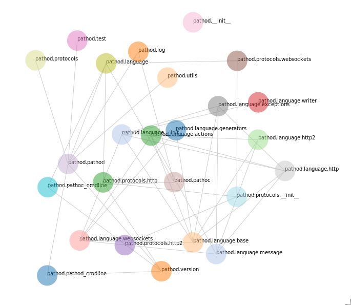

# imports

Visualize dependencies among python modules using NetworkX and d3.js

## why?

I'm currently working on porting mitmproxy to Python 3. The mitmproxy package has several modules (like netlib, pathod etc.) each of which needs to be separately ported. I started working on pathod by arbitrarily selecting its sub-modules and porting them but that caused a lot of pain since the modules depend on each other in weird ways.

The correct way to work through the modules is to create a dependency graph (showing which module depends on which) and use [Topological Sorting](https://en.wikipedia.org/wiki/Topological_sorting).

## todo

* generalize: remove all mentions of mitmproxy
* use docopt/click for argument parsing
* add proper instructions so others can use it too